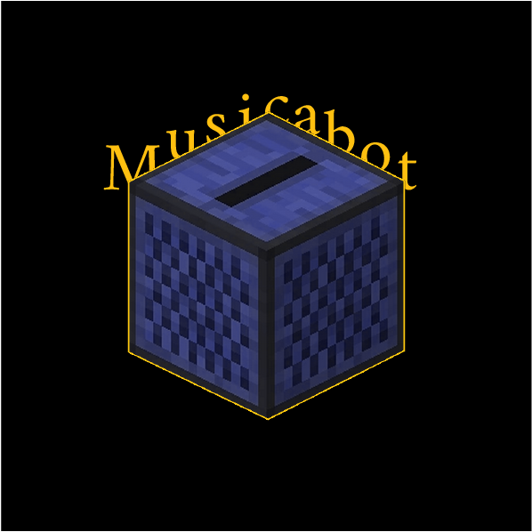

# Musical Discord Bot (MusicaBot)

A discord bot that can be used to play music from youtube.

## Setup
- Create a file called `config.json` in the root directory based on the `config.template.json` file.
- Fill in the properties in the `config.json` file with your own API discord tokens. To do this, you'll need to create a bot on `https://discord.com/developers/applications` and check the options `bot`, `applications.commands` and `Administrator` in the `Bot Permissions` section.
- Run `npm run deploy` once. This will register the commands on your bot on the discord server.
- Run `npm run start` each time you want to run your bot.
- Invite the bot to your server using the link `https://discord.com/api/oauth2/authorize?client_id=YOUR_CLIENT_ID&permissions=8&scope=bot%20applications.commands`.
- Enjoy!

## Commands
To see all commands type `/help` in a text channel.

Here are the current list of commands:
- `/ping`: Ping the status of the server.
- `/join`: Join the user's audio channel.
- `/leave`: Leave the audio channel and clear the queue.
- `/pause`: Pause the player.
- `/play`: Play or resume a music/playlist.
- `/queue`: List all of the current tracks in the queue.
- `/skip`: Skip the current playing song.
- `/stop`: Stop the player and clear the queue.
